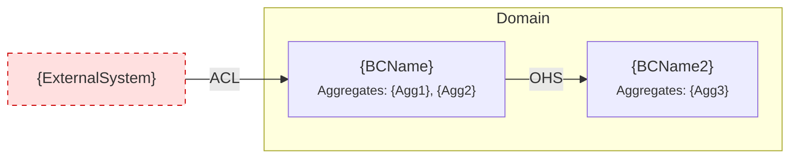

# Context Map Template

<!--
Use this template for the top-level context-map.md file.
Shows all bounded contexts and their relationships across the entire domain.
Uses Mermaid for visualization.

File path: product-management/domain/context-map.md
-->

# Context Map

## Bounded Contexts

| BC | Source Capability | Core Responsibility | Aggregates | Directory |
|----|------------------|--------------------|-----------------|-----------| 
| {BCName} | C{n} {CapabilityName} | {what this context owns} | {Agg1}, {Agg2} | `{bc-slug}/` |
| {BCName2} | C{m} {CapabilityName2} | {what this context owns} | {Agg3} | `{bc2-slug}/` |

---

## Relationships

| Upstream | Downstream | Pattern | Integration Notes |
|----------|-----------|---------|-------------------|
| {BCName} | {BCName2} | OHS | {how they integrate} |
| {ExternalSystem} | {BCName} | ACL | {how we adapt their model} |

<!--
Relationship patterns:
- ACL (Anti-Corruption Layer): Downstream translates upstream's model into its own language
- OHS (Open Host Service): Upstream publishes a well-defined API for multiple consumers
- Conformist: Downstream adopts upstream's model without translation
- Partnership: Both sides evolve together, coordinated changes
-->

---

## Diagram

---

## Traceability Index

<!--
Reverse lookup: from Journey / Feature / User Story → domain concepts.
Generated from Source fields in aggregate .md files.
Enables answering: "Which aggregates implement Feature F5?"
                    "Which domain concepts trace back to Journey J3?"
                    "What did User Story US42 produce in the domain model?"
-->

### By Journey

| Journey | Phase | Pain Point | Feature | BC | Aggregate | Commands | Events |
|---------|-------|------------|---------|----|-----------|---------:|--------|
| J{n} | Phase {m} | #{k} {description} | F{n} | {bc-slug} | {AggName} | {Cmd1}, {Cmd2} | {Evt1}, {Evt2} |

### By Feature

| Feature | Journey Source | BC | Aggregates | Commands | Events | Invariants |
|---------|--------------|----|-----------|---------:|--------|------------|
| F{n} {name} | J{n}.Phase{m}.PainPoint#{k} | {bc-slug} | {Agg1}, {Agg2} | {Cmd1}, ... | {Evt1}, ... | #{n}, #{m} |

### By User Story

| US | Feature | BC | Aggregate | Commands | Events | Invariants |
|----|---------|----|-----------|---------:|--------|------------|
| US{n} | F{n} | {bc-slug} | {AggName} | {Cmd1} | {Evt1} | #{n} {summary} |
