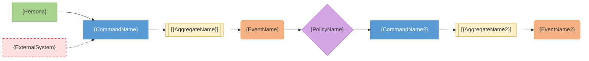

# Event Storming Output Template

<!--
Use this template for the event-storming.md artifact.
Fill tables from interactive elicitation results (Steps 1-3).
-->

# Event Storming: {change-name}

## Context

- **Feature:** F{n} {feature name}
- **User Stories:** US{n}, US{m}
- **Journeys:** J{n} ({pain point count} pain points)
- **Personas:** P{n} {name} (actor), P{m} {name} (actor)
- **Complexity:** {Simple / Complex} → {Fast-Path / Interactive}

---

## Domain Events (Orange)

| # | Event | Trigger | Source | Notes |
|---|-------|---------|--------|-------|
| E1 | | | | |

## Commands (Blue)

| # | Command | Actor | Triggers Event | Source |
|---|---------|-------|----------------|--------|
| C1 | | | | |

## Aggregates (Yellow)

| # | Aggregate | Root Entity | Commands | Key Invariants |
|---|-----------|-------------|----------|----------------|
| A1 | | | | |

## Policies (Lilac)

| # | Policy | Trigger Event | Resulting Command | Source |
|---|--------|---------------|-------------------|--------|
| P1 | | | | |

## Read Models (Green) — CQRS Read Side

| # | Read Model | Data | Updated By | Query Criteria | Consumer |
|---|------------|------|-----------|---------------|----------|
| R1 | | | | | |

## External Systems (Pink)

| # | System | Provides | Failure Mode | Provider |
|---|--------|----------|-------------|----------|
| X1 | | | | |

## Hotspots / Open Questions

| # | Question | Context | Resolution |
|---|----------|---------|-----------|
| H1 | | | |

---

## Event Flow Summary

<!--
Mermaid flowchart showing the complete command→aggregate→event→policy chains.
Use IDs from the tables above (C1, A1, E1, P1, etc.) for traceability.
Actor nodes on the left, external systems on the right.
-->

