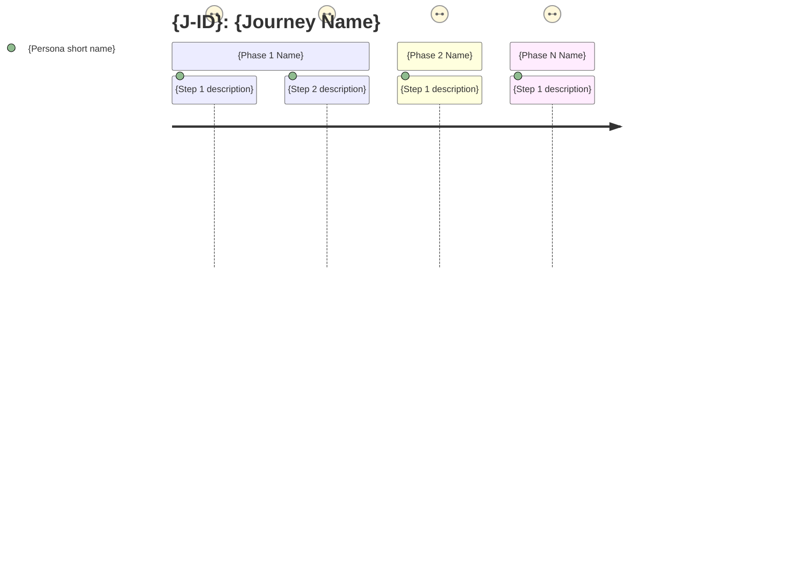
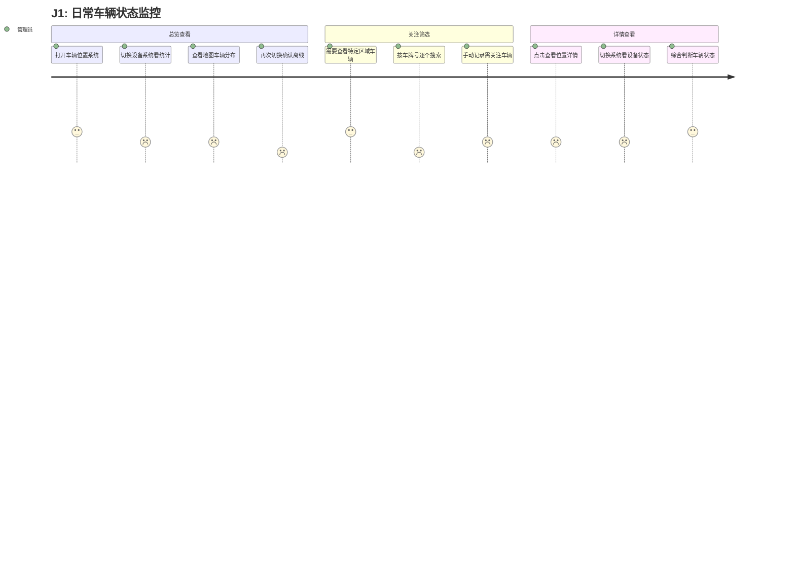
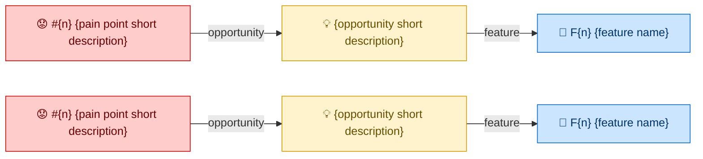
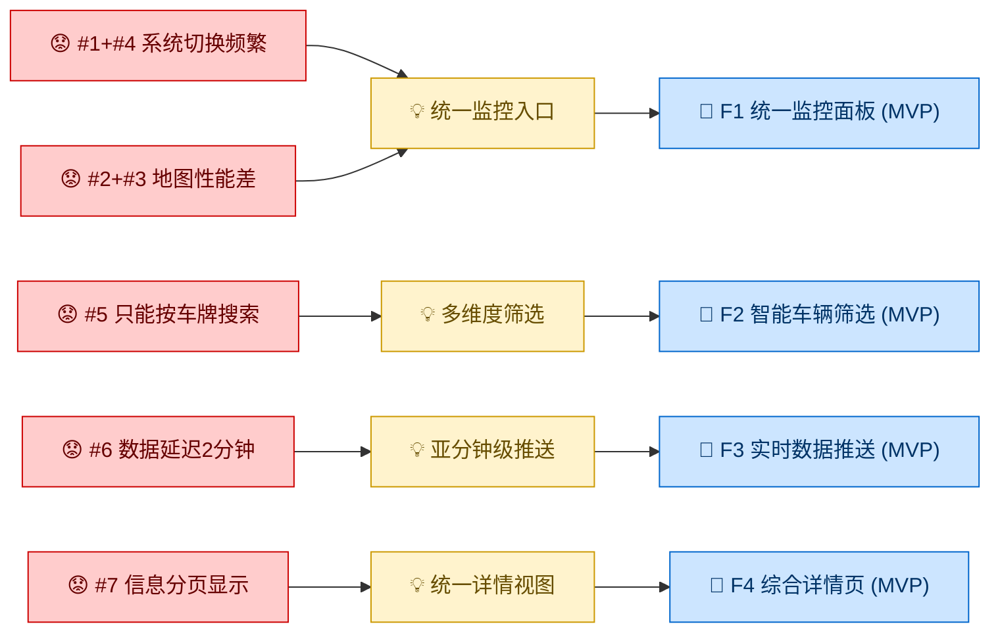
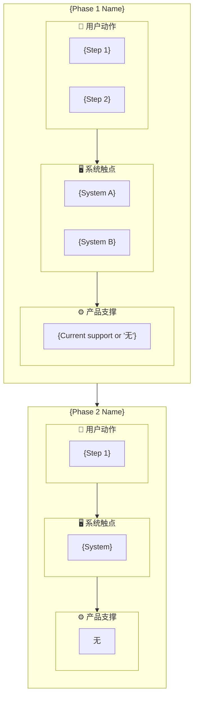
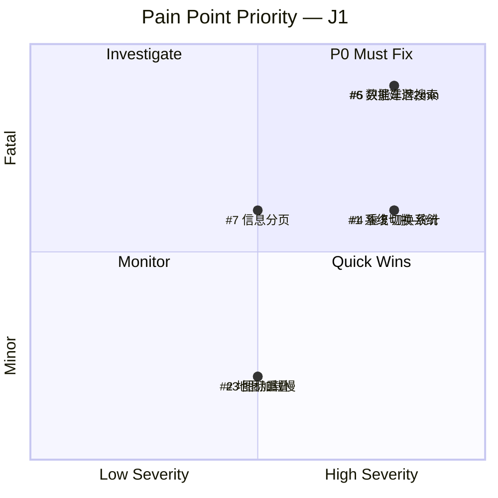

# Journey Diagram Generation

Rules and templates for generating visual diagrams from Journey data. Diagrams are embedded as Mermaid code blocks in the Journey markdown file, rendering natively on GitHub/GitLab/Obsidian.

This follows the same inline Mermaid convention established by product-discovery's domain model diagrams.

## Methodology-Diagram Mapping

Each diagram type traces directly to the methodology origin documented in README.md's "Concept-to-Source Traceability":

| Diagram | Origin Methodology | What It Visualizes |
|---|---|---|
| Journey Emotion Map | Customer Journey Mapping (CJM) + Emotional Journey (UXPressia) | Phase flow + emotion arc + actor swim lanes |
| Feature Derivation Chain | Design Thinking (Stanford d.school) — Define→Ideate transition | Pain Point → Opportunity → Feature traceability |
| Service Blueprint | Service Blueprint (Shostack, 1984) — Customer/Frontstage/Backstage layers | Three-layer display per phase (用户动作 / 系统触点 / 产品支撑) |
| Pain Point Priority Matrix | Moments of Truth (Carlzon) + severity analysis | Severity × Criticality quadrant for prioritization |

## Generation Rules

### Tiered Generation

Not all diagrams are generated every time. The agent evaluates conditions after each workflow step and auto-decides:

| Diagram | When to Generate | Trigger Condition |
|---|---|---|
| **Journey Emotion Map** | **Always** | Every Journey has phases + emotion arcs — this is the core visual |
| **Feature Derivation Chain** | **Always** (when Step 3 produces Features) | The skill's primary value is traceability — this diagram IS the trace |
| **Service Blueprint** | **Conditional** | 3+ distinct system touchpoints across the Journey's phases |
| **Pain Point Priority Matrix** | **Conditional** | 5+ pain points in the Pain Points Summary |

### When to Generate Each

| After Workflow Step | Diagrams Generated |
|---|---|
| Step 2 (Journey Assembly) | Journey Emotion Map + Service Blueprint (if triggered) |
| Step 3 (Feature Derivation) | Feature Derivation Chain |
| Step 4a (Gap Analysis) | Pain Point Priority Matrix (if triggered) |

### Presentation to User

After generating diagrams, present them inline during the confirmation step:

> "我为这条旅程生成了可视化图表：
>
> [Diagram 1: Journey Emotion Map]
> [Diagram 2: Feature Derivation Chain]
> [Diagram 3 (if applicable): Service Blueprint]
> [Diagram 4 (if applicable): Pain Point Priority Matrix]
>
> 图表会嵌入到最终的 Journey 文件中。需要调整吗？"

---

## Diagram Templates

### 1. Journey Emotion Map

**Mermaid type:** `journey`

**Purpose:** Horizontal phase timeline with emotion scoring per step. The emotion arc (the line connecting the smiley faces) is automatically generated by Mermaid from the scores.

**Score mapping from Journey emotions:**

| Journey Emotion Tag | Mermaid Score Range | Guideline |
|---|---|---|
| ↑ 正向 (positive) | 4–5 | 5 = delighted, 4 = satisfied |
| → 中性 (neutral) | 3 | routine, no strong feeling |
| ↓ 负向 (negative) | 1–2 | 1 = blocked/furious, 2 = frustrated |

Within a Phase, assign scores per step:
- Steps with ⚠️ problems: score 1 or 2 (based on pain point severity)
- Steps without problems: inherit the Phase emotion (↑→3-5, →→3, ↓→2)
- Steps that trigger the worst pain point in a Fatal moment: score 1

**Template:**

````markdown

````

**Rules:**
- Section names = Phase names from the Journey
- Task names = step descriptions (keep under 40 chars — truncate if needed)
- Actor = Persona's short role name (e.g., "管理员", not "P1 车队管理员")
- If a step involves a system interaction AND a user action, list both actors: `{step}: {score}: {Persona}, {System}`
- Order follows the Journey's Phase → Step sequence exactly

**Example (from journey-examples.md):**

````markdown

````

---

### 2. Feature Derivation Chain

**Mermaid type:** `flowchart LR`

**Purpose:** Visualize the traceability chain from Pain Points through Opportunities to Features. This is the diagrammatic expression of Design Thinking's Define→Ideate transition.

**Template:**

````markdown

````

**Rules:**
- Node IDs: `PP{n}` for pain points, `OP{n}` for opportunities, `F{n}` for features
- Grouped pain points (e.g., #1+#4): combine into one PP node with both numbers
- Out-of-boundary pain points (❌): omit from diagram entirely
- ~F cross-check results:
  - ✅ verified: include the Feature with a note `(~F{n} ✅)` in the label
  - ❓ not encountered: add as a disconnected node with dashed border
  - merged: don't show separately, note in parent Feature label
- Features with Phase=MVP: add `(MVP)` suffix to the label
- Keep descriptions under 25 chars in nodes — full text lives in the markdown tables

**Example:**

````markdown

````

---

### 3. Service Blueprint (Conditional)

**Mermaid type:** `flowchart TD`

**Trigger:** 3+ distinct system touchpoints across the Journey's phases.

**Purpose:** Visualize Shostack's Service Blueprint layers — the three-layer distinction (用户动作 / 系统触点 / 产品支撑) that is core to this skill's methodology. Each Phase becomes a column, each layer becomes a row.

**Template:**

````markdown

````

**Rules:**
- Three subgraph rows per Phase: 用户动作 (top), 系统触点 (middle), 产品支撑 (bottom)
- Touchpoints must cross-reference Persona's "当前工具/系统" field
- Product support: show actual current capability or "无" for greenfield
- Phase-to-Phase connections: left-to-right flow showing the Journey progression
- Keep step descriptions brief (under 20 chars) — the full detail lives in the Phase sections above
- Highlight pain-point steps with red styling: `classDef painStep fill:#FFCCCC,stroke:#CC0000`

---

### 4. Pain Point Priority Matrix (Conditional)

**Mermaid type:** `quadrantChart`

**Trigger:** 5+ pain points in the Pain Points Summary.

**Purpose:** Map Carlzon's Moments of Truth onto a visual priority quadrant. Helps stakeholders quickly see which pain points demand immediate attention vs. which can be deferred.

**Axis mapping from Journey data:**

| Journey Field | → Quadrant Axis | Score Mapping |
|---|---|---|
| Severity (高/中/低) | X-axis (Low → High) | 低=0.2, 中=0.5, 高=0.8 |
| Criticality (致命/重要/一般) | Y-axis (Minor → Fatal) | 一般=0.2, 重要=0.6, 致命=0.9 |

**Template:**

````markdown
```mermaid
quadrantChart
    title Pain Point Priority — {J-ID}
    x-axis Low Severity --> High Severity
    y-axis Minor --> Fatal
    quadrant-1 P0 Must Fix
    quadrant-2 Investigate
    quadrant-3 Monitor
    quadrant-4 Quick Wins
    {Pain Point #1 short label}: [{severity_score}, {criticality_score}]
    {Pain Point #2 short label}: [{severity_score}, {criticality_score}]
    {Pain Point #3 short label}: [{severity_score}, {criticality_score}]
```
````

**Rules:**
- Only include in-scope (✅) pain points — omit out-of-boundary (❌) ones
- Label = short description (under 20 chars), prepend `#N` for traceability
- Quadrant interpretation:
  - **Q1 (top-right): P0 Must Fix** — High severity + Fatal criticality → MVP Features
  - **Q2 (top-left): Investigate** — Low severity but Fatal criticality → could be a design gap
  - **Q3 (bottom-left): Monitor** — Low severity + Minor criticality → defer
  - **Q4 (bottom-right): Quick Wins** — High severity but Minor criticality → easy improvements

**Example:**

````markdown

````

---

## Diagram Section Placement in Journey File

All diagrams are embedded in a `## Diagrams` section at the end of the Journey file, after Gap Analysis and before Status:

```markdown
## Gap Analysis
...

## Diagrams

### Journey Emotion Map
[mermaid journey diagram]

### Feature Derivation Chain
[mermaid flowchart LR diagram]

### Service Blueprint
[mermaid flowchart TD diagram — only if 3+ touchpoints]

### Pain Point Priority
[mermaid quadrantChart — only if 5+ pain points]

## Status
Draft | Confirmed
```

Conditional diagrams are simply omitted (no empty placeholder). The section heading `## Diagrams` is always present if at least one diagram is generated (which is always true — Journey Emotion Map is mandatory).
