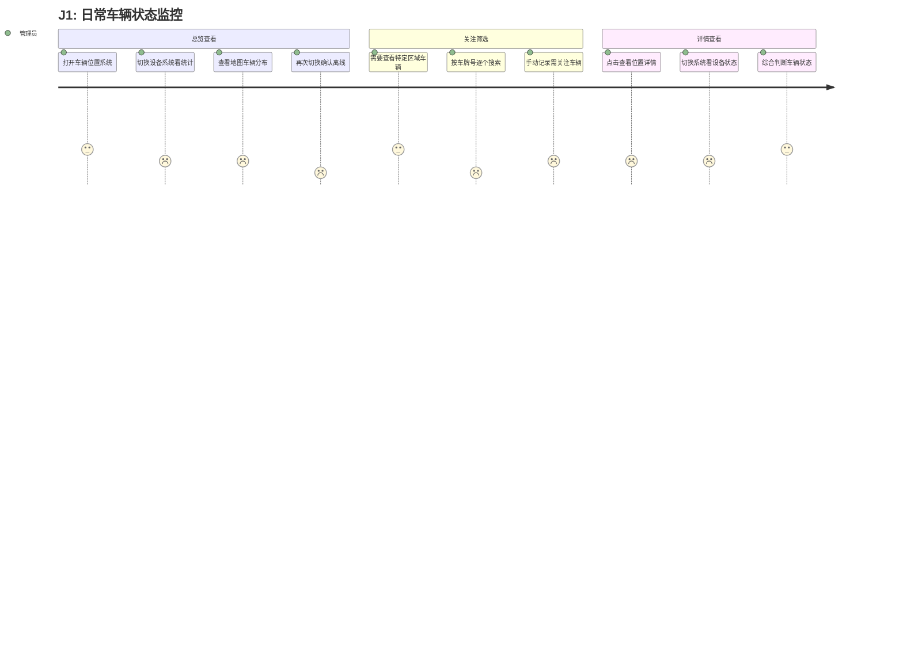
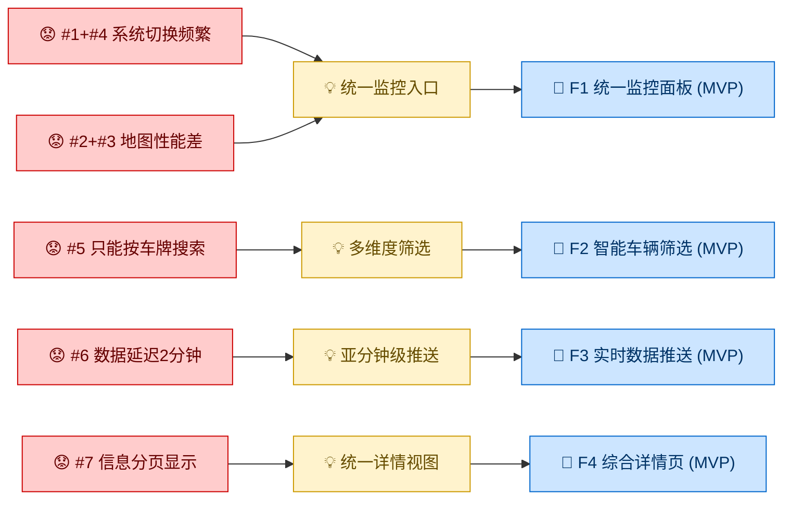
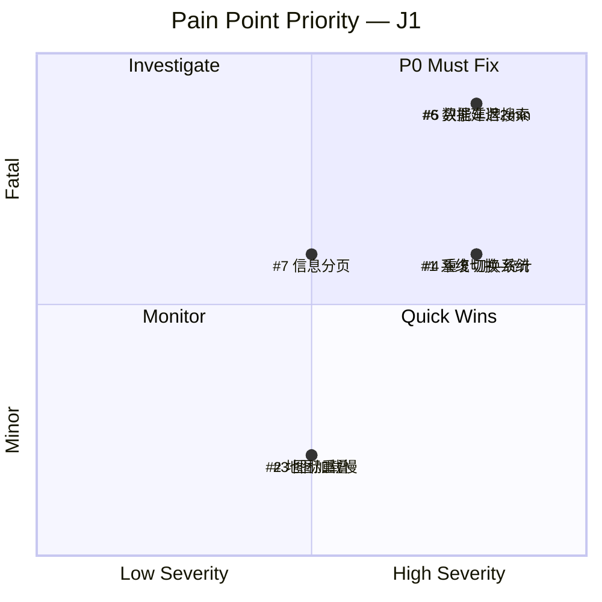

# Journey Examples

Complete worked example showing the journey-designer workflow, using the Connected Vehicle Fleet Management case from product-framer's examples.

---

## Input: product-framer Outputs

### Capability File (C1-vehicle-monitoring.md, excerpt)

```markdown
# Capability: [C1] 实时车辆监控

## User Goal
车队管理员在一个界面实时看到所有车辆的位置和状态

## Service Personas
P1 - 车队管理员

## Scope
**Includes:** 车辆地图、实时位置、设备在线状态、车辆详情
**Excludes:** 异常告警处理、安全报告

## Conceptual Scenes
| ID | 场景名称 | 触发情境 | 关键活动 |
|---|---|---|---|
| ~S1 | 日常车辆监控 | 早上开始工作 | 查看车辆分布、检查离线车辆 |
| ~S2 | 车辆详情查看 | 需要了解某辆车 | 查看位置、速度、设备状态 |

## Feature Candidates
| ID | 功能名称 | 一句话描述 | 来源 |
|---|---|---|---|
| ~F1 | 车辆地图实时定位 | 地图上显示所有车辆实时位置 | Scope.Includes |
| ~F2 | 设备在线状态面板 | 展示 T-Box 在线/离线/故障状态 | Scope.Includes |
| ~F3 | 车辆详情页 | 单车的完整状态信息 | ~S2 |
```

### Persona File (P1-fleet-manager.md, excerpt)

```markdown
# Persona: [P1] 车队管理员

## 类型
用户角色

## 目标
- 实时掌握所有车辆状态，快速处理异常

## 日常工作
早上到办公室先看车辆分布，全天持续监控，发现异常立刻处理。月底出安全报告。

## 当前工具/系统
- 车辆位置系统：查看车辆 GPS 位置
- 设备状态系统：查看 T-Box 设备在线/离线
- 驾驶行为评分系统：查看司机驾驶评分
- Excel：拼接数据做月报

## 痛点
- 三个系统切换频繁，信息分散
- 异常发现滞后
- 月报手工拼接耗时

## 驱动力
- 保障车队安全运营
- 减少事故率
```

---

## Step 0: Load Context + Journey Scoping

### 0a — Load Files (Agent reads silently)

Agent reads C1-vehicle-monitoring.md and P1-fleet-manager.md.

### 0b — Journey Scoping

```
┌──────────────────────────────────────────────────────────────┐
│  Journey Designer                                (Step 0/4)  │
│  Context Load + Journey Scoping                              │
├──────────────────────────────────────────────────────────────┤
│  Capability: C1 实时车辆监控                                  │
│  Persona: P1 车队管理员                                      │
│                                                              │
│  Conceptual Scenes (~S):                                     │
│  · ~S1 日常车辆监控 — 触发：早上开始工作                        │
│  · ~S2 车辆详情查看 — 触发：需要了解某辆车                      │
│                                                              │
│  Feature Candidates (~F):                                    │
│  · ~F1 车辆地图实时定位                                       │
│  · ~F2 设备在线状态面板                                       │
│  · ~F3 车辆详情页                                            │
│                                                              │
│  Persona Context:                                            │
│  · 日常：早上看车辆分布，全天监控，发现异常立刻处理              │
│  · 工具：车辆位置系统、设备状态系统、驾驶评分系统、Excel         │
│  · 痛点：三系统切换、异常发现慢、月报手工拼                     │
│  · 驱动力：保障安全运营、减少事故率                              │
│                                                              │
│  等待确认：Journey 分组方案                                    │
└──────────────────────────────────────────────────────────────┘
```

Agent proposes:

> "~S1 日常车辆监控 和 ~S2 车辆详情查看 是同一个管理员的连续行为——先看全局，再看某辆车的详情。建议合并为一条 Journey：
>
> **J1: 日常车辆状态监控**
> - 串联: ~S1 + ~S2
> - Persona: P1 车队管理员
> - Trigger: 早上到办公室开始工作
> - Phases: 总览 → 筛选关注 → 深入查看 → 处理发现
>
> 这样分合理吗？"

User: "对，合并合理。不过处理发现应该是异常处理的范围（C2），不属于 C1。"

Agent: "明白。去掉'处理发现'阶段，Journey 范围到'深入查看'为止。修正后：
- Phases: 总览查看 → 关注筛选 → 详情查看

确认？"

User: "确认。"

---

## Step 1: Phase-by-Phase Enrichment

### Phase 1: 总览查看

**1a — Agent Drafts Steps**

```
┌──────────────────────────────────────────────────────────────┐
│  J1: 日常车辆状态监控 — Phase Enrichment         (Step 1/4)  │
├──────────────────────────────────────────────────────────────┤
│  Progress: Phase 1 of 3                                      │
│                                                              │
│  当前: Phase 1: 总览查看                                      │
│  ├── Step 1: 打开车辆位置系统                                 │
│  ├── Step 2: 查看地图上的车辆分布                              │
│  └── Step 3: 切换到设备状态系统检查离线车辆                     │
│                                                              │
│  待处理:                                                     │
│  · Phase 2: 关注筛选                                         │
│  · Phase 3: 详情查看                                         │
│                                                              │
│  这些步骤是否准确？有遗漏吗？                                  │
└──────────────────────────────────────────────────────────────┘
```

User: "差不多，不过 Step 2 之前会先看一眼今天在线车辆数量和离线数量的统计。不是直接看地图。"

Agent: "了解。更新步骤：
1. 打开车辆位置系统
2. 查看今日车辆在线/离线统计数字
3. 查看地图上的车辆分布
4. 切换到设备状态系统确认具体哪些车离线

确认？"

User: "确认。"

**1b — Problem Discovery**

Agent: "在 Step 1（打开车辆位置系统）这一步，有什么困难或不便吗？"

User: "没什么，就是打开网页登录。"

Agent: "在 Step 2（查看在线/离线统计）这一步呢？"

User: "这个数据在设备状态系统里，不在位置系统里。所以要先打开另一个系统才能看到统计。"

Agent: "也就是说为了看一个统计数字，就需要切换系统？"

User: "对，所以其实 Step 2 和 Step 4 要用同一个系统，中间还夹着位置系统的地图。来回切。"

Agent: "明白了。我更新问题标注：
- Step 2: ⚠️ 需要切换到设备状态系统才能看统计，中断工作流
- Step 4: ⚠️ 再次切回设备状态系统确认详情，重复切换

Step 3（看地图）有什么问题吗？"

User: "地图加载比较慢，100 多辆车的时候要等 5-6 秒。而且车辆图标太密，大城市区域分不清。"

Agent: "记录了。

Step 3: ⚠️ 车辆多时地图加载慢（5-6秒），⚠️ 密集区域车辆图标重叠难以分辨"

**1c — Layered Display + 1d — Emotion**

Agent confirms Phase 1:

```
Phase 1: 总览查看

用户动作:
1. 打开车辆位置系统
2. 切换到设备状态系统查看在线/离线统计
   ⚠️ 问题: 统计数据在另一个系统，需要切换
3. 切换回车辆位置系统查看地图
   ⚠️ 问题: 100+车辆时加载慢（5-6秒），密集区域图标重叠
4. 切换到设备状态系统确认离线车辆详情
   ⚠️ 问题: 再次切换系统，重复操作

系统触点: 车辆位置系统、设备状态系统

产品支撑（现状）: 无

情绪: ↓ 负向 — 早上第一件事就要在两个系统间来回切，每次等几秒加载
      （对应 Persona 痛点: 三系统切换频繁）
```

User: "准确。"

---

### Phase 2: 关注筛选 (abbreviated)

Agent drafts → user confirms steps → discovers problem: "只能按车牌号搜索，没有按区域、状态、车队分组筛选" → emotion: ↓ 负向

### Phase 3: 详情查看 (abbreviated)

Agent drafts → user confirms steps → discovers problem: "详情页数据刷新间隔 2 分钟，不够实时" + "位置和设备状态在不同页面，还是要切换" → emotion: ↓ 负向

---

### Mid-Conversation Calibration

```
┌──────────────────────────────────────────────────────────────┐
│  💡 中间校准 — J1                                             │
├──────────────────────────────────────────────────────────────┤
│  到目前为止的旅程理解：                                        │
│                                                              │
│  Phase 1: 总览查看                                           │
│    管理员早上开始 → 在位置系统和设备系统间切换 → 卡在系统切换    │
│    情绪: ↓ — 一上来就切换多个系统                              │
│                                                              │
│  Phase 2: 关注筛选                                           │
│    想看特定区域的车 → 只能按车牌搜索 → 卡在筛选能力不足         │
│    情绪: ↓ — 100+辆车逐个找                                  │
│                                                              │
│  Phase 3: 详情查看                                           │
│    点进单车 → 数据 2 分钟刷新 → 位置和设备状态分开看            │
│    情绪: ↓ — 看到的不是实时数据                                │
│                                                              │
│  这个理解对吗？哪里需要修正？                                   │
└──────────────────────────────────────────────────────────────┘
```

User: "对的，没问题。"

---

## Step 2: Journey Assembly

### 2a — Full Journey

(Same state panel as before)

### 2b — Completion Criteria (Agent Drafts)

Agent: "基于旅程的最后一步——管理员在详情页综合判断车辆状态——我认为这条 Journey 的完成标准是：**管理员在一个工作会话内确认全部车辆当前状态，识别出需关注的车辆。** 准确吗？"

User: "对，就是这个意思。"

### 2c — Pain Points Summary

```
┌──────────────────────────────────────────────────────────────┐
│  J1: 日常车辆状态监控 — Full Journey             (Step 2/4)  │
├──────────────────────────────────────────────────────────────┤
│  Persona: P1 车队管理员                                      │
│  Trigger: 早上到办公室开始工作                                │
│  Completion: 管理员确认全部车辆当前状态，识别出需关注的车辆    │
│  Source: C1 ~S1 日常车辆监控, C1 ~S2 车辆详情查看             │
│                                                              │
│  Phase 1: 总览查看                         情绪: ↓ 负向       │
│    Steps: 4 步（含 3 个问题）                                 │
│    Touchpoints: 车辆位置系统、设备状态系统                     │
│                                                              │
│  Phase 2: 关注筛选                         情绪: ↓ 负向       │
│    Steps: 3 步（含 1 个问题）                                 │
│    Touchpoints: 车辆位置系统                                  │
│                                                              │
│  Phase 3: 详情查看                         情绪: ↓ 负向       │
│    Steps: 3 步（含 2 个问题）                                 │
│    Touchpoints: 车辆位置系统、设备状态系统                     │
├──────────────────────────────────────────────────────────────┤
│  Pain Points:                                                │
│  #1 Ph1 S2: 看统计需切换系统     严重度:高 关键度:重要 ✅      │
│  #2 Ph1 S3: 地图加载慢(5-6s)    严重度:中 关键度:一般 ✅      │
│  #3 Ph1 S3: 密集区域图标重叠     严重度:中 关键度:一般 ✅      │
│  #4 Ph1 S4: 重复切换设备系统     严重度:高 关键度:重要 ✅      │
│  #5 Ph2 S2: 只能按车牌号搜索     严重度:高 关键度:致命 ✅      │
│  #6 Ph3 S1: 数据刷新间隔2分钟    严重度:高 关键度:致命 ✅      │
│  #7 Ph3 S2: 位置和设备分页显示   严重度:中 关键度:重要 ✅      │
├──────────────────────────────────────────────────────────────┤
│  Journey 全景确认？                                           │
└──────────────────────────────────────────────────────────────┘
```

Agent explains criticality:

> "#5（只能按车牌搜索）标记为**致命**——管理 100+ 辆车时如果无法按区域/状态筛选，整个监控流程效率极低，基本无法完成日常工作。
>
> #6（数据刷新间隔 2 分钟）标记为**致命**——实时监控的核心就是'实时'，2 分钟延迟意味着看到的状态已经过时。
>
> 这些判断合理吗？"

User: "合理。确认。"

---

## Step 3: Feature Derivation

```
┌──────────────────────────────────────────────────────────────┐
│  J1: Feature Derivation                          (Step 3/4)  │
├──────────────────────────────────────────────────────────────┤
│  Pain Point → Opportunity → Feature:                         │
│                                                              │
│  #1+#4 系统切换 → 统一监控入口 → F1 统一车辆监控面板           │
│     ~F Status: C1 ~F1 车辆地图实时定位 ✅ verified (扩展)     │
│                                                              │
│  #2+#3 地图性能 → 大规模车辆地图优化 → F1 (merged)            │
│     (grouped into F1)                                        │
│                                                              │
│  #5 搜索受限 → 多维度筛选 → F2 智能车辆筛选                    │
│     ~F Status: New (Journey-discovered)                      │
│                                                              │
│  #6 数据延迟 → 亚分钟级推送 → F3 实时数据推送                  │
│     ~F Status: New (Journey-discovered)                      │
│                                                              │
│  #7 信息分页 → 统一详情视图 → F4 车辆综合详情页                 │
│     ~F Status: C1 ~F3 车辆详情页 ✅ verified (扩展)           │
│                                                              │
│  ~F 未出现:                                                  │
│  · C1 ~F2 设备在线状态面板 — ❓ 未在旅程中独立出现              │
│                                                              │
│  确认/调整？                                                  │
└──────────────────────────────────────────────────────────────┘
```

Agent: "C1 ~F2（设备在线状态面板）没有作为独立功能在旅程中出现——设备状态信息在旅程中是作为 F1（统一面板）和 F4（综合详情页）的一部分被消费的。是作为独立面板单独做，还是合并进 F1 和 F4？"

User: "合并进 F1 和 F4，不需要独立的设备状态面板。"

Agent: "记录：C1 ~F2 设备在线状态面板 — 合并入 F1/F4，不独立。"

---

## Step 4: Gap Analysis + Output

### 4a — Gap Analysis

```
┌──────────────────────────────────────────────────────────────┐
│  Gap Analysis                                    (Step 4/4)  │
├──────────────────────────────────────────────────────────────┤
│  Phase ↔ Feature Coverage:                                   │
│  [✓] Phase 1: F1 统一监控面板                                │
│  [✓] Phase 2: F2 智能筛选                                    │
│  [✓] Phase 3: F3 实时推送, F4 综合详情                        │
│                                                              │
│  Feature ↔ Phase Coverage:                                   │
│  [✓] F1 → Phase 1                                           │
│  [✓] F2 → Phase 2                                           │
│  [✓] F3 → Phase 3                                           │
│  [✓] F4 → Phase 3                                           │
│                                                              │
│  ~F Disposition:                                             │
│  [✓] ~F1 → F1 (verified, expanded)                          │
│  [✓] ~F2 → merged into F1/F4 (confirmed unnecessary)        │
│  [✓] ~F3 → F4 (verified, expanded)                          │
│                                                              │
│  ✅ Gap Analysis 通过 — 无缺口，无冗余                        │
└──────────────────────────────────────────────────────────────┘
```

### 4b — Output Files

**Journey file: `product-management/journeys/J1-daily-monitoring.md`**

```markdown
# Journey: [J1] 日常车辆状态监控

## Persona
P1 - 车队管理员（引用 personas/P1-fleet-manager.md）

## Trigger
早上到办公室开始工作，需要掌握全部车辆的当前状态

## Completion Criteria
管理员在一个工作会话内确认全部车辆当前状态，识别出需关注的车辆

## Source
- **Capability**: C1 - 实时车辆监控
- **Conceptual Scenes**: C1 ~S1 日常车辆监控, C1 ~S2 车辆详情查看

## Phases

### Phase 1: 总览查看

**用户动作:**
1. 打开车辆位置系统
2. 切换到设备状态系统查看今日在线/离线统计
   - ⚠️ 问题: 统计数据在另一个系统，需要切换中断工作流
3. 切换回车辆位置系统查看地图上的车辆分布
   - ⚠️ 问题: 100+ 车辆时加载慢（5-6秒）
   - ⚠️ 问题: 密集区域车辆图标重叠难以分辨
4. 切换到设备状态系统确认具体哪些车离线
   - ⚠️ 问题: 再次切换系统，重复操作

**系统触点:** 车辆位置系统、设备状态系统

**产品支撑（现状）:** 无

**情绪:** ↓ 负向 — 早上第一件事就在两个系统间来回切，每次等几秒加载（Persona 痛点: 信息分散）

### Phase 2: 关注筛选

**用户动作:**
1. 需要查看特定区域或特定状态的车辆
2. 在车辆位置系统中按车牌号逐个搜索
   - ⚠️ 问题: 只支持车牌号搜索，无法按区域/状态/车队分组筛选
3. 手动记录需要关注的车辆

**系统触点:** 车辆位置系统

**产品支撑（现状）:** 无

**情绪:** ↓ 负向 — 管理 100+ 辆车只能按车牌号找，效率极低（Persona 痛点: 信息分散）

### Phase 3: 详情查看

**用户动作:**
1. 在车辆位置系统中点击某辆车查看位置详情
   - ⚠️ 问题: 页面数据刷新间隔 2 分钟，看到的可能是过时状态
2. 切换到设备状态系统查看该车的设备信息
   - ⚠️ 问题: 位置信息和设备状态在不同系统的不同页面，无法一屏对照
3. 综合判断车辆当前状态

**系统触点:** 车辆位置系统、设备状态系统

**产品支撑（现状）:** 无

**情绪:** ↓ 负向 — 实时监控看到的数据是 2 分钟前的（Persona 驱动力: 保障安全运营，需要实时数据）

## Completion Criteria Validation

旅程终态"管理员确认全部车辆当前状态"在 Phase 3 完成时达成 — 管理员查看完详情后，对需关注车辆已有判断。✅ 终态可达。

## Pain Points Summary

| # | Phase | Step | 痛点 | 严重度 | 关键度 | 边界检查 |
|---|---|---|---|---|---|---|
| 1 | Phase 1 | Step 2 | 看统计需切换到设备状态系统 | 高 | 重要 | ✅ 范围内 |
| 2 | Phase 1 | Step 3 | 100+ 车辆地图加载慢（5-6秒） | 中 | 一般 | ✅ 范围内 |
| 3 | Phase 1 | Step 3 | 密集区域车辆图标重叠 | 中 | 一般 | ✅ 范围内 |
| 4 | Phase 1 | Step 4 | 确认离线详情需再次切换系统 | 高 | 重要 | ✅ 范围内 |
| 5 | Phase 2 | Step 2 | 只能按车牌号搜索，无多维度筛选 | 高 | 致命 | ✅ 范围内 |
| 6 | Phase 3 | Step 1 | 数据刷新间隔 2 分钟，非实时 | 高 | 致命 | ✅ 范围内 |
| 7 | Phase 3 | Step 2 | 位置和设备信息在不同页面 | 中 | 重要 | ✅ 范围内 |

## Opportunities

| Pain Point | Opportunity | → Feature |
|---|---|---|
| #1+#4 系统切换 | 如果能在一个界面同时看到位置和设备状态，管理员不用切换系统 | F1 |
| #2+#3 地图性能 | 如果能优化大规模车辆渲染和聚合显示，总览效率提升 | F1 |
| #5 搜索受限 | 如果能按区域/状态/车队分组筛选，管理 100+ 车辆不用逐个找 | F2 |
| #6 数据延迟 | 如果能实现亚分钟级数据推送，监控才真正"实时" | F3 |
| #7 信息分页 | 如果能在一个详情页看到位置+设备+驾驶数据，不用切换 | F4 |

## Feature Mapping

| Phase | Pain Point | Feature | ~F Status |
|---|---|---|---|
| Phase 1 | #1+#2+#3+#4 | F1 统一车辆监控面板 | C1 ~F1 ✅ verified (expanded) |
| Phase 2 | #5 | F2 智能车辆筛选 | New (Journey-discovered) |
| Phase 3 | #6 | F3 实时数据推送 | New (Journey-discovered) |
| Phase 3 | #7 | F4 车辆综合详情页 | C1 ~F3 ✅ verified (expanded) |
| — | — | — | C1 ~F2 → merged into F1/F4 |

## Gap Analysis

### Feature Gaps
（无）

### Feature Orphans
（无）

## Diagrams

### Journey Emotion Map



### Feature Derivation Chain



### Pain Point Priority

> 7 pain points → quadrantChart triggered (threshold: 5+)



> Service Blueprint not generated — only 2 distinct touchpoints (车辆位置系统, 设备状态系统), below the 3+ threshold.

## Status
Confirmed

---
*Created: 2026-04-20*
```

**Feature file example: `product-management/features/F2-vehicle-search.md`**

```markdown
# Feature: [F2] 智能车辆筛选

## Description
管理员可以按区域、车辆状态、车队分组等多维度快速筛选目标车辆，替代逐一按车牌号搜索。

## Source
- **Capability**: C1 - 实时车辆监控
- **Journey**: J1 Phase 2 - 关注筛选
- **~F Reference**: New (Journey-discovered, 不在原始 ~F 列表中)

## Problem Solved
J1 Pain Point #5 — 管理 100+ 辆车时只能按车牌号搜索，无法快速定位关注车辆。

## User Value
管理员筛选目标车辆从逐个输入车牌号（分钟级）变为一键按条件过滤（秒级），日常监控效率大幅提升。

## Scope
**Includes:**
- 按区域/地理围栏筛选
- 按车辆状态筛选（在线/离线/故障）
- 按车队/分组筛选
- 组合条件筛选
- 筛选结果在地图上高亮

**Excludes:**
- 历史轨迹搜索（属于 C1 但不属于此 Feature）
- 异常事件搜索（属于 C2）

## Phase
MVP

## Dependencies
F1 统一车辆监控面板（筛选功能基于统一面板运行）

## Status
Candidate

---
*Created: 2026-04-20*
```

### 4c — Completion

```
┌──────────────────────────────────────────────────────────────┐
│  Output                                          (Step 4/4)  │
├──────────────────────────────────────────────────────────────┤
│  ✓ J1-daily-monitoring.md  → product-management/journeys/    │
│  ✓ F1-unified-dashboard.md → product-management/features/    │
│  ✓ F2-vehicle-search.md   → product-management/features/     │
│  ✓ F3-realtime-push.md    → product-management/features/     │
│  ✓ F4-vehicle-detail.md   → product-management/features/     │
├──────────────────────────────────────────────────────────────┤
│  Journey 设计完成！                                           │
│  下一步：user-story skill 创建 User Story                    │
└──────────────────────────────────────────────────────────────┘
```
