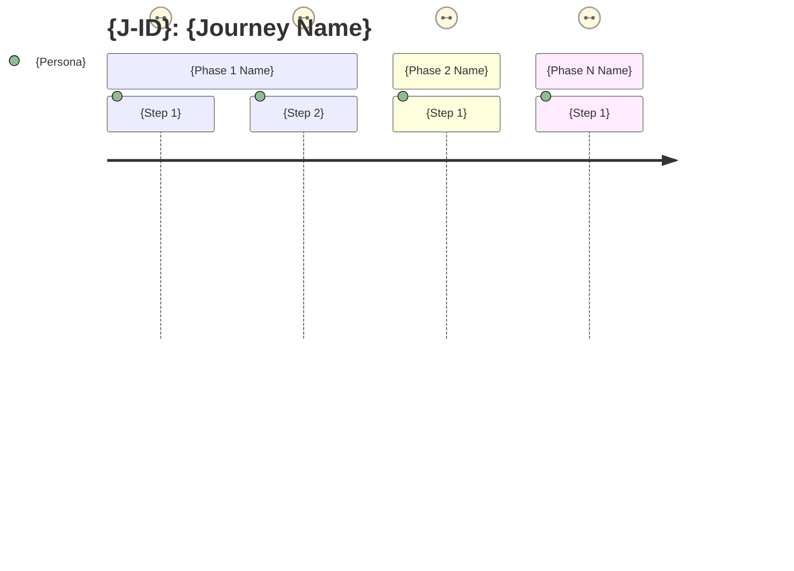
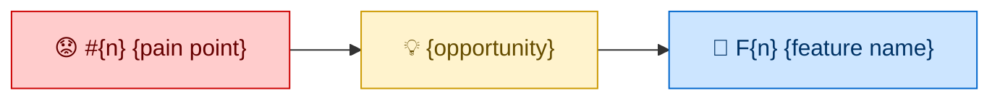

# Journey Template

```markdown
# Journey: [{J-ID}] [Name]

## Persona

[P-ID] - [角色名]（引用 personas/P{n}-{name}.md，只读）

## Trigger

[什么情况下开始这条旅程 — 具体的触发条件，不是抽象描述]

## Completion Criteria

[这条旅程"成功完成"的可观测终态 — 用户看到什么、系统处于什么状态]
（例："管理员在一个界面确认所有车辆当前状态，无需切换系统"）

## Source

- **Capability**: [C-ID] - [Name]（如跨多个 Capability，逐一列出）
- **Conceptual Scenes**: [C{x} ~S{n} Name], [C{x} ~S{n} Name]

## Phases

### Phase 1: [阶段名]

**用户动作:**
1. [步骤 1]
2. [步骤 2]
   - ⚠️ 问题: [来自步骤的痛点描述]
3. [步骤 3]

**系统触点:** [当前使用的工具/系统/界面，对照 Persona 的"当前工具"]

**产品支撑（现状）:** [我们产品当前提供的能力，或"无"]

**情绪:** [↑ 正向 / → 中性 / ↓ 负向] — [一句话原因，引用 Persona 痛点或驱动力]

### Phase 2: [阶段名]
...

### Phase N: [阶段名]
...

## Pain Points Summary

| # | Phase | Step | 痛点 | 严重度 | 关键度 | 边界检查 |
|---|---|---|---|---|---|---|
| 1 | Phase 1 | Step 2 | [痛点描述] | 高/中/低 | 致命/重要/一般 | ✅ 范围内 / ❌ 产品边界外 |
| 2 | Phase 2 | Step 1 | [痛点描述] | 高/中/低 | 致命/重要/一般 | ✅ / ❌ |

## Opportunities

| Pain Point | Opportunity | → Feature |
|---|---|---|
| #1 [痛点简述] | [如果能……就能……] | F{n} |
| #2 [痛点简述] | [如果能……就能……] | F{n} |
| #3 [痛点简述] | — | 超出范围 |

## Feature Mapping

| Phase | Pain Point | Feature | ~F Status |
|---|---|---|---|
| Phase 1 | #1 | F{n} [名称] | C{x} ~F{n} ✅ verified |
| Phase 2 | #2 | F{n} [名称] | New (Journey-discovered) |
| — | — | — | C{x} ~F{n} ❓ not encountered |

## Gap Analysis

### Feature Gaps（Phase 有 Fatal/Important 痛点但无 Feature 支撑）
- [Phase X: 描述] → 需要新增 Feature / 用户确认接受缺口

### Feature Orphans（Feature 无对应 Phase）
- [F{n}: 描述] → 确认是否需要

## Diagrams

### Journey Emotion Map



### Feature Derivation Chain



<!-- Include Service Blueprint ONLY if 3+ distinct touchpoints across phases -->
<!-- Include Pain Point Priority Matrix ONLY if 5+ pain points -->
<!-- See references/diagram-generation.md for conditional rules and templates -->

## Status

Draft | Confirmed

---

*Created: [YYYY-MM-DD]*
*Updated: [YYYY-MM-DD]*
```

## Fields

| Field | Description | When Filled |
|-------|-------------|-------------|
| Persona | P-ID reference to persona file (read-only) | Step 0 |
| Trigger | Specific condition that starts the journey | Step 0 |
| Completion Criteria | Observable end state that defines "journey succeeded" | Step 2 |
| Source | Capability + ~S references for traceability | Step 0 |
| Phases | Enriched phases with steps, touchpoints, emotions | Step 1 |
| Pain Points Summary | Compiled table with severity + criticality + boundary check | Step 2 |
| Opportunities | Pain Point → Opportunity mapping | Step 3 |
| Feature Mapping | Complete traceability from Phase to Feature to ~F status | Step 3 |
| Gap Analysis | Two-way coverage check results | Step 4 |
| Diagrams | Mermaid diagrams: Journey Emotion Map (always), Feature Derivation Chain (always), Service Blueprint (if 3+ touchpoints), Pain Point Priority Matrix (if 5+ pain points) | Steps 2-4 |
| Status | Draft or Confirmed | Step 4 |

## Severity Guide

| Level | Definition | Example |
|-------|-----------|---------|
| **High** | Blocks work or causes significant delay | "切换 3 个系统找一辆车要 5 分钟" |
| **Medium** | Slows down but work continues | "报告模板不够灵活，需要手动调整" |
| **Low** | Minor annoyance | "界面字体太小" |

## Criticality Guide (Moments of Truth)

| Level | Definition | Implication |
|-------|-----------|-------------|
| **Fatal (致命)** | This step fails → entire Journey cannot complete | Moment of Truth. Feature for this pain point is P0. |
| **Important (重要)** | Significant experience degradation, Journey continues | Feature is P1. |
| **Minor (一般)** | Inconvenience only | Feature is P2 or deferred. |
