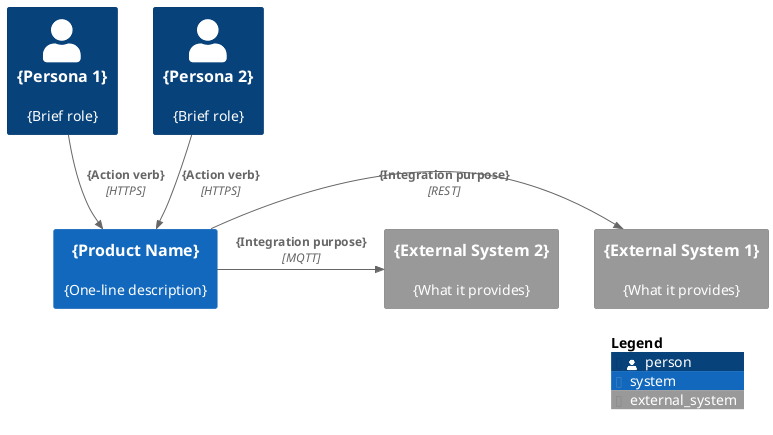
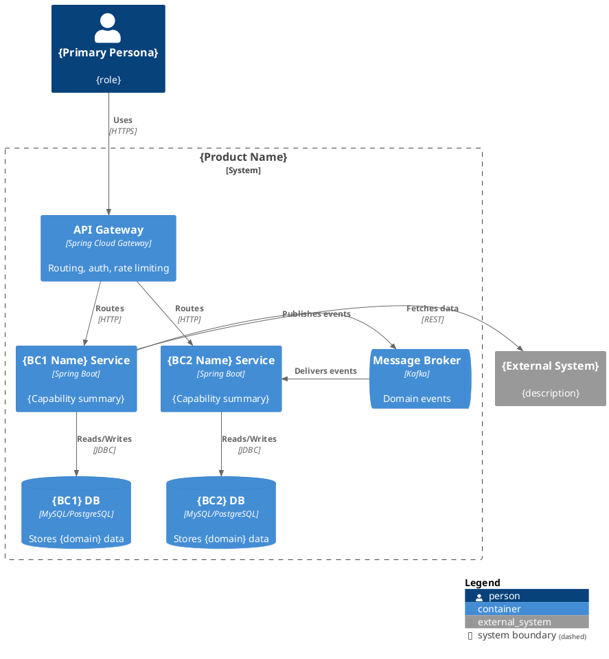
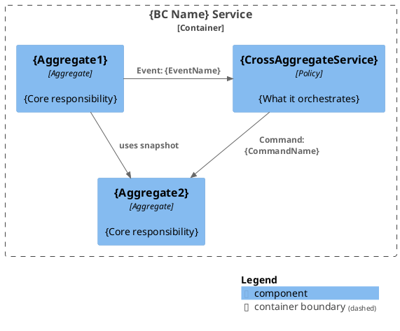
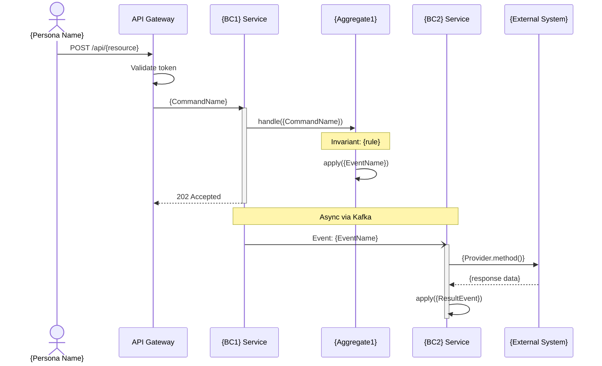
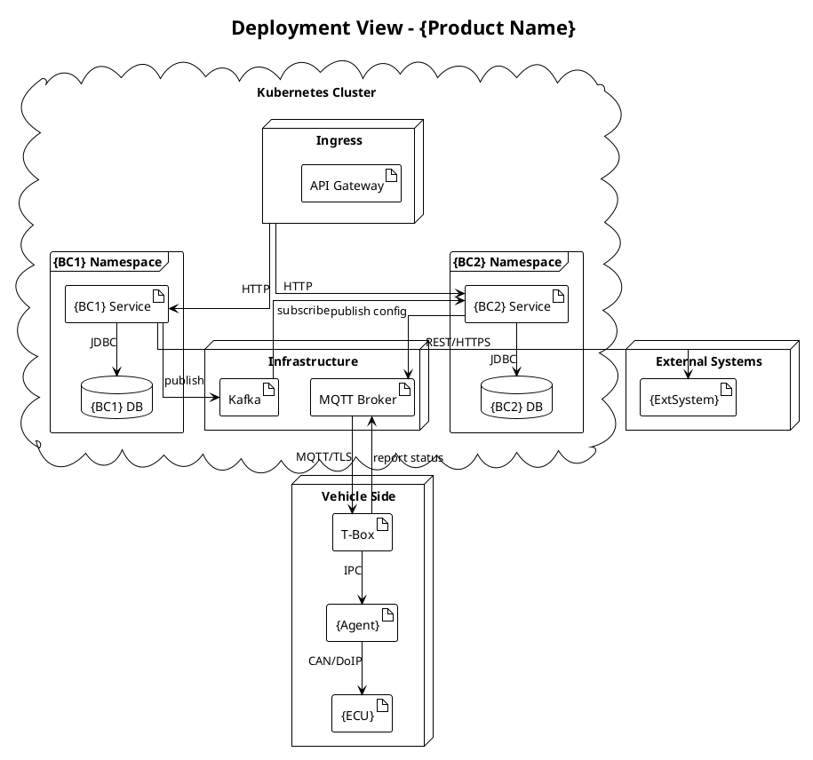

# Diagram Conventions

Standards for diagram generation in the SAD. PlantUML C4 library for architecture diagrams (superior layout control), Mermaid for sequence diagrams (clean message syntax).

---

## Tool Selection

| Diagram Type | Tool | Reason |
|---|---|---|
| C4 System Context | PlantUML C4 | Graphviz layout engine, directional control (`Rel_Down`, `Rel_Right`) |
| C4 Container | PlantUML C4 | Same, plus `System_Boundary()` nesting |
| C4 Component | PlantUML C4 | Consistent with Context/Container, aggregate collaboration |
| Sequence | Mermaid | Clean message syntax, good layout for linear flows |
| Deployment | PlantUML | Node/cloud nesting, deployment-specific notation |

---

## PlantUML C4 Diagrams

All C4 diagrams use the [C4-PlantUML](https://github.com/plantuml-stdlib/C4-PlantUML) standard library via `!include <C4/C4_Context>`, `!include <C4/C4_Container>`, `!include <C4/C4_Component>`.

### Layout Control

| Macro | Effect |
|---|---|
| `LAYOUT_TOP_DOWN()` | Flow from top to bottom (default for Context) |
| `LAYOUT_LEFT_RIGHT()` | Flow from left to right (good for pipelines) |
| `LAYOUT_LANDSCAPE()` | Left-to-right without rotating directional rels |
| `Rel_Down(from, to, ...)` | Force arrow downward |
| `Rel_Right(from, to, ...)` | Force arrow rightward |
| `Rel_Left(from, to, ...)` | Force arrow leftward |
| `Rel_Up(from, to, ...)` | Force arrow upward |
| `SHOW_LEGEND()` | Add color legend at bottom |

**Layout strategy:**
- Actors at top → `Rel_Down` to system
- System in center
- External systems at right → `Rel_Right` from system
- Within boundaries, let Graphviz auto-layout

### System Context Diagram (§3)



**Rules:**
- Maximum 6-8 elements (beyond that, group personas)
- Use directional rels to keep actors on top, externals on right
- Relationship labels = verb phrases + protocol
- Always include `SHOW_LEGEND()` for readability

### Container Diagram (§5 Level 1)



**Rules:**
- One container per BC (1 BC = 1 service)
- Infrastructure containers: Gateway, Message Broker, databases
- BCs without domain models still appear (label: "{Name} Service [planned]")
- Database per service (even if type is TBD)
- Use `Rel_Down` for user→gateway→services, `Rel_Right` for service→external

### Component Diagram (§5 Level 2, per BC)



**Rules:**
- Only TWO component types: Aggregates + Cross-Aggregate Domain Services
- Relationships show event flows and command issuance between components
- Snapshot/reference dependencies shown with `Rel()` (no forced direction)
- If aggregate count > 5, group by functional subdomain
- Maximum 10 components per diagram

---

## Mermaid Diagrams

### Sequence Diagrams (§6)



**Rules:**
- Title each diagram with the flow name: `## {Flow Name}`
- Use `->>` for sync calls, `-)` for async messages
- Show `activate`/`deactivate` for request scope
- Include invariant checks as `Note over` when they affect flow
- Show auth step at Gateway level
- Maximum 8 participants per diagram (merge if needed)
- Use HTTP verbs for external-facing calls, Command names for internal

---

## PlantUML Deployment Diagram (§7)



**Rules:**
- K8s cluster = `cloud` notation
- Namespace per BC = `frame` notation
- Vehicle side = separate `node` zone (physical boundary: different hardware/network)
- MQTT Broker = bridge between cloud and vehicle zones
- External systems outside both zones
- Show protocol on every relationship (especially cloud↔vehicle boundary)
- If network isolation was specified, add boundary boxes
- Keep simplified — no replica counts, no resource specs

---

## General Styling Rules

### Naming Conventions

| Element | Naming Style | Example |
|---------|-------------|---------|
| Services | {BC Name} Service | Offering Management Service |
| Databases | {BC} DB | Offering DB |
| Aggregates | {AggregateName} | Offering, FpcCode |
| External systems | Full name from context-map | OAS (Offering Administration System) |
| Message broker | Technology name | Kafka |
| API Gateway | "API Gateway" (fixed) | API Gateway |

### Complexity Limits

| Diagram Type | Max Elements | If Exceeded |
|---|---|---|
| Context | 8 | Group minor actors |
| Container | 12 | Split into zones |
| Component | 10 per BC | Focus on key aggregates |
| Sequence | 8 participants | Merge services |
| Deployment | 15 nodes | Simplify to logical view |

---

## Embedding in Markdown

### PlantUML

````markdown
```plantuml
{diagram content}
```
````

### Mermaid

````markdown
```mermaid
{diagram content}
```
````

PlantUML requires a rendering plugin or server (VS Code PlantUML extension, GitLab native, or PlantUML server). Mermaid renders natively in GitHub, GitLab, and Obsidian.
