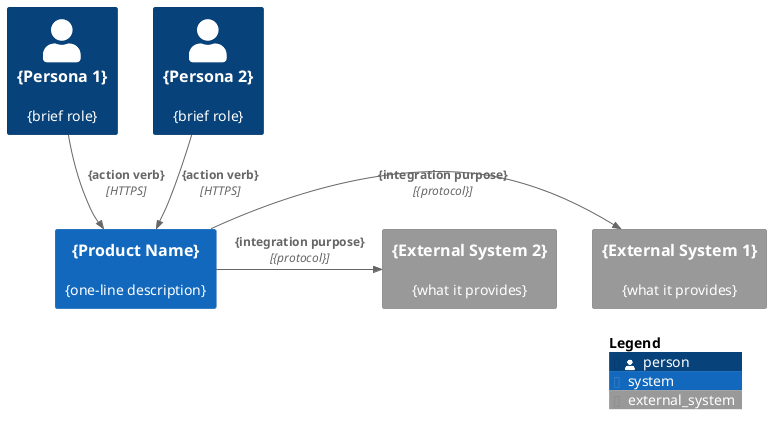
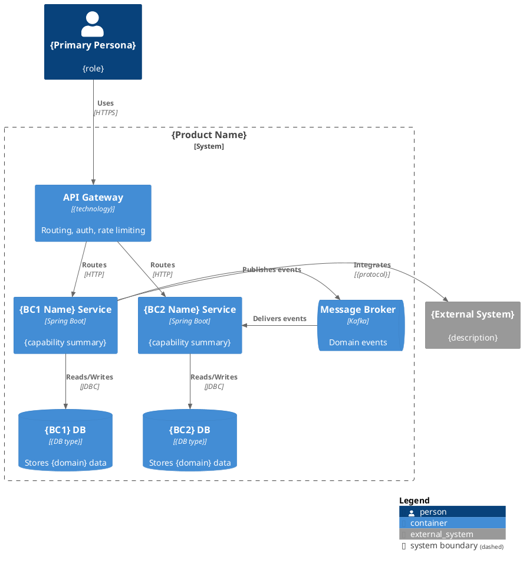
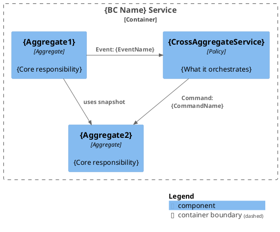
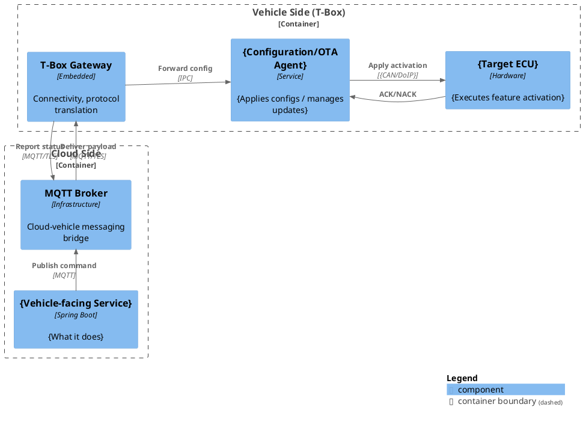
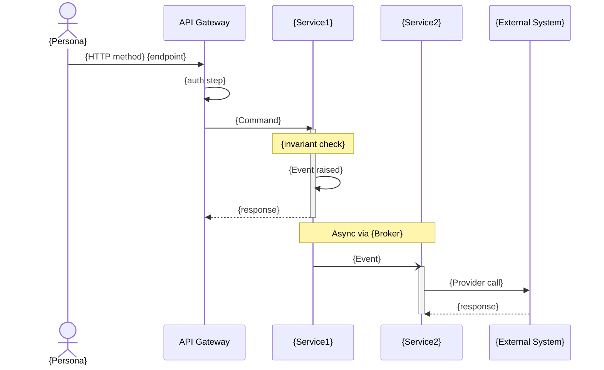
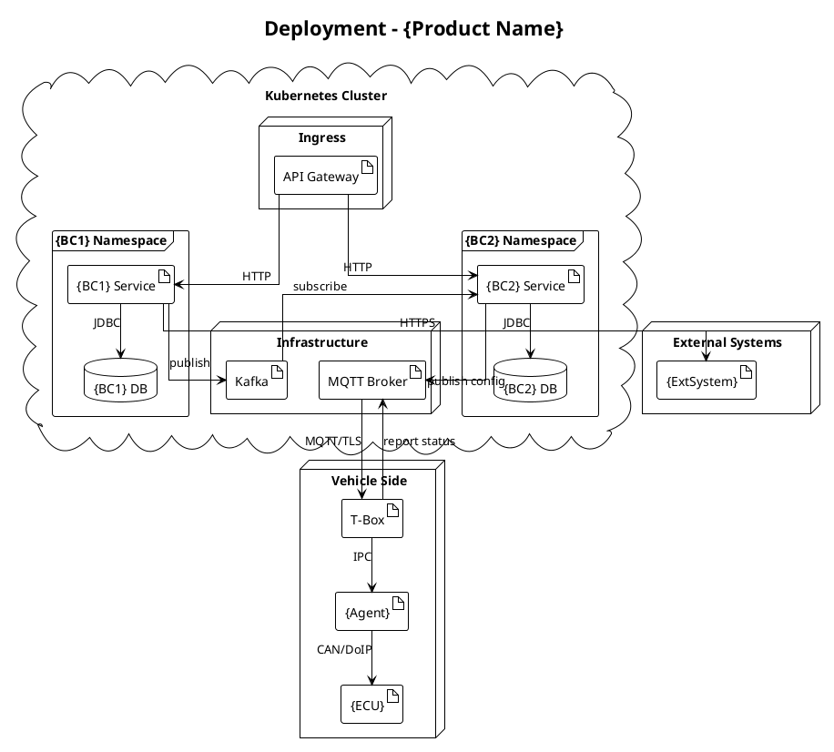

# SAD Template

<!-- This is the output template for the generated SAD file. Placeholders use {curly_braces}. Sections with [TBD] markers indicate information not yet available. -->

```markdown
<!-- Generated by: sad-generator | Date: {YYYY-MM-DD} | Source: product-management/ -->

# Software Architecture Document: {Product Name}

{One-line product description from Vision}

---

## Table of Contents

1. [Introduction & Goals](#1-introduction--goals)
2. [Architecture Constraints](#2-architecture-constraints)
3. [Context & Scope](#3-context--scope)
4. [Solution Strategy](#4-solution-strategy)
5. [Building Block View](#5-building-block-view)
6. [Runtime View](#6-runtime-view)
7. [Deployment View](#7-deployment-view)
8. [Cross-cutting Concepts](#8-cross-cutting-concepts)
9. [Quality Requirements](#9-quality-requirements)
10. [Risks & Technical Debt](#10-risks--technical-debt)
11. [Glossary](#11-glossary)

---

## 1. Introduction & Goals

### 1.1 Business Goals

<!-- Source: vision.md → Business Problems (reframed as goals) -->

| # | Goal | Priority |
|---|------|----------|
| 1 | {goal derived from business problem} | {P0/P1/P2} |
| 2 | {goal} | {priority} |
| 3 | {goal} | {priority} |

### 1.2 Architecture Goals

<!-- Source: vision.md → Core Values (quality-oriented goals) -->

| Quality Attribute | Goal | Measure |
|---|---|---|
| {attribute} | {goal statement} | {measurable criterion} |
| {attribute} | {goal statement} | {measurable criterion} |

### 1.3 Stakeholders

<!-- Source: personas/P*.md -->

| Stakeholder | Role | Key Concerns |
|---|---|---|
| {P-ID} {Name} | {User Role / Review Role} | {top 2-3 concerns from persona goals/pain points} |
| {P-ID} {Name} | {role} | {concerns} |

---

## 2. Architecture Constraints

### 2.1 Technical Constraints

<!-- Source: vision.md → Constraints -->

| Constraint | Description | Impact |
|---|---|---|
| {constraint name} | {description} | {which architecture decisions this affects} |

### 2.2 Scope Exclusions (Non-Goals)

<!-- Source: vision.md → Non-Goals -->

The system explicitly does NOT:
- {non-goal 1}
- {non-goal 2}
- {non-goal 3}

### 2.3 Key Assumptions

<!-- Source: vision.md → Assumptions -->

This architecture assumes:
- {assumption 1}
- {assumption 2}

> If any assumption is invalidated, sections {affected sections} need re-evaluation.

---

## 3. Context & Scope

### 3.1 System Context Diagram

<!-- Source: capabilities + context-map + personas -->



### 3.2 Functional Scope

<!-- Source: capabilities.yaml or capabilities/C*.md -->

| Capability | Description | Status |
|---|---|---|
| {C-ID} {Name} | {User Goal from capability file} | {Modeled / Planned} |

### 3.3 External System Interfaces

<!-- Source: context-map.md External Systems + aggregate Provider sections -->

| External System | Integration Type | Data Exchanged | Protocol |
|---|---|---|---|
| {system name} | {ACL / OHS / Conformist} | {what data flows} | {REST / SOAP / MQTT / etc.} |

---

## 4. Solution Strategy

### 4.1 Technology Decisions

<!-- Source: elicitation results + defaults -->

| Concern | Decision | Rationale |
|---|---|---|
| Service Framework | {Spring Cloud / Spring Boot} | {rationale} |
| API Gateway | {gateway choice} | {rationale} |
| Authentication | {OAuth2.0 / JWT / other} | {rationale} |
| Sync Communication | {REST / gRPC} | {rationale} |
| Async Communication | {Kafka / other} | {rationale} |
| Service Discovery | Consul (current) / K8s native (target) | {rationale} |
| Deployment Platform | {Kubernetes} | {rationale} |
| Database | {per-service DB, type} | {rationale} |

### 4.2 Architecture Pattern

<!-- Derived from domain model structure -->

**Overall Pattern:** {Microservices / Modular Monolith}
- Service boundary: Bounded Context
- Communication: {sync for queries, async for events}
- Data: Database per service (no shared DB)

---

## 5. Building Block View

### 5.1 Level 1 — Container Diagram

<!-- Source: context-map.md BCs + elicited infrastructure -->



### 5.2 Level 2 — Component View

<!-- One subsection per modeled BC. Source: domain/{bc-slug}/ -->

#### 5.2.1 {BC Name} Service

**Aggregates:** {list}
**Cross-Aggregate Domain Services:** {list}

<!-- Embed PlantUML C4 component diagram — shows aggregate collaboration -->



<!-- Repeat 5.2.x for each modeled BC -->

#### 5.2.x {Planned BC Name} Service [Planned]

> [TBD — Domain model not yet created. Run `event-storming` skill for this BC.]

**Known scope (from Capability):**
- {Capability.Scope.Includes items}

### 5.3 Vehicle-Side Component View

<!-- Generated when any Capability involves cloud-vehicle interaction. Shows vehicle-side components at the same architectural depth as cloud-side services. -->

**Trigger:** {Capability that involves vehicle interaction, e.g., C4 Cloud Vehicle Config Delivery}
**Communication Protocol:** {MQTT over TLS / proprietary}
**Intra-Vehicle Bus:** {CAN / DoIP / UDS}



**Vehicle-Side Components:**

| Component | Type | Responsibility | Communication |
|---|---|---|---|
| T-Box Gateway | Embedded hardware | Connectivity (4G/5G), protocol translation, OTA reception | MQTT↔Cloud, IPC↔internal |
| {Agent Name} | Embedded service | Interprets cloud commands, orchestrates ECU activation | IPC from T-Box, {bus} to ECU |
| {Target ECU} | Hardware controller | Executes feature activation/deactivation | {CAN/DoIP/UDS} |

---

## 6. Runtime View

### 6.1 {Flow Name 1}

<!-- Source: event-storming flow or journey cross-system interaction -->

**Trigger:** {what initiates this flow}
**Actors:** {who/what participates}
**Significance:** {why this flow is architecturally important}



<!-- Repeat 6.x for each selected flow (max 5) -->

### 6.x {Flow Name N}

{Same structure as above}

---

## 7. Deployment View

<!-- Source: elicitation results + defaults -->

### 7.1 Deployment Diagram



### 7.2 Infrastructure Notes

| Component | Technology | Notes |
|---|---|---|
| Container Orchestration | {Kubernetes} | {cluster details if known} |
| Ingress | {Nginx / ALB / etc.} | {TBD if unknown} |
| Service Mesh | {Istio / None / TBD} | |
| Persistent Storage | {EBS / NFS / etc.} | {TBD if unknown} |

---

## 8. Cross-cutting Concepts

### 8.1 Authentication & Authorization

<!-- Source: elicitation Q1 -->

**Pattern:** {OAuth2.0 + Gateway unified / JWT per-service / etc.}

**Token Flow:**
{Description of how authentication tokens propagate between services}

### 8.2 Anti-Corruption Layer (ACL)

<!-- Source: context-map.md ACL relationships -->

**Applied to:** {external system name}
**Pattern:** Provider adapter translates external model to domain model
**Implementation:** `@Provider` classes in {BC name}

### 8.3 CQRS (Command Query Responsibility Segregation)

<!-- Source: aggregate files with Read Model sections -->

**Applied in:** {BC names where Read Models exist}
**Write side:** Aggregates handle Commands, emit Events
**Read side:** Read Models project Events into query-optimized views

### 8.4 Event-Driven Communication

<!-- Source: domain model Policy + Event patterns -->

**Pattern:** Domain Events published via {Message Broker}
**Naming Convention:** Past tense, aggregate-prefixed (e.g., `OfferingPublished`, `FpcCodeSynced`)
**Payload:** Typed using Value Objects from domain model
**Idempotency:** {Strategy — TBD if not specified}

### 8.5 Error Handling & Resilience

<!-- Source: Provider Failure Strategy fields -->

| Integration | Failure Strategy | Pattern |
|---|---|---|
| {External System} | {from Provider.FailureStrategy} | {retry / circuit breaker / fallback} |

---

## 9. Quality Requirements

### 9.1 Quality Attribute Scenarios

<!-- Source: vision.md Constraints + review personas -->

| ID | Quality Attribute | Scenario | Measure |
|---|---|---|---|
| QA-1 | {Performance/Security/Availability/...} | {stimulus → response} | {metric} |
| QA-2 | {attribute} | {scenario} | {metric} |

### 9.2 Non-Functional Requirements

<!-- Source: vision.md Constraints (NFR-relevant) -->

| Requirement | Source | Architecture Impact |
|---|---|---|
| {NFR description} | Vision.Constraints | {what this requires architecturally} |

---

## 10. Risks & Technical Debt

### 10.1 Architectural Risks

<!-- Source: BC hotspots, integration dependencies -->

| Risk | Probability | Impact | Mitigation |
|---|---|---|---|
| {risk description} | {H/M/L} | {H/M/L} | {mitigation strategy or "open"} |

### 10.2 Technical Debt

<!-- Source: missing domain models, incomplete analysis -->

| Debt Item | Type | Resolution Path |
|---|---|---|
| {BC name} lacks domain model | Design debt | Run event-storming skill |
| {section} marked TBD | Documentation debt | Make pending decision |

---

## 11. Glossary

<!-- Source: all BC README.md Ubiquitous Language sections -->

| Term | Definition | Context |
|---|---|---|
| {term} | {definition} | {BC name or "system-wide"} |

---

## References

| Artifact | Location | Description |
|---|---|---|
| Product Vision | `../vision.md` | Business goals, constraints, personas index |
| Context Map | `../domain/context-map.md` | BC relationships, external systems |
| {BC Name} Domain Model | `../domain/{bc-slug}/` | Aggregates, events, commands |
| Journey Maps | `../journeys/` | User interaction paths |
| Feature Definitions | `../features/` | Feature scope and traceability |

---

*Generated: {YYYY-MM-DD}*
*Source: product-management/*
*Skill: sad-generator (Harness Engineering)*
```

---

## Template Usage Notes

### Placeholder Syntax

- `{curly_braces}` — replaced by derived or elicited content
- `{choice1 / choice2}` — one of the options, selected based on context
- `<!-- Source: ... -->` — derivation source comment (kept in output for traceability)

### Conditional Sections

- Sections with `[Planned]` suffix: generated for BCs without domain models
- Sections with `> [TBD — ...]`: information not yet available
- Sequence diagram count: 3-5 based on flow complexity scoring

### Section Omission Rules

- NEVER omit a section entirely — always include the heading + at minimum a TBD note
- Exception: §8 subsections (8.1-8.5) only include patterns that are DETECTED in the domain model. Don't include "CQRS" subsection if no Read Models exist.

### Cross-Reference Format

References to upstream artifacts use relative paths from the `architecture/` directory:
- `../vision.md`
- `../domain/context-map.md`
- `../journeys/J1-*.md`
